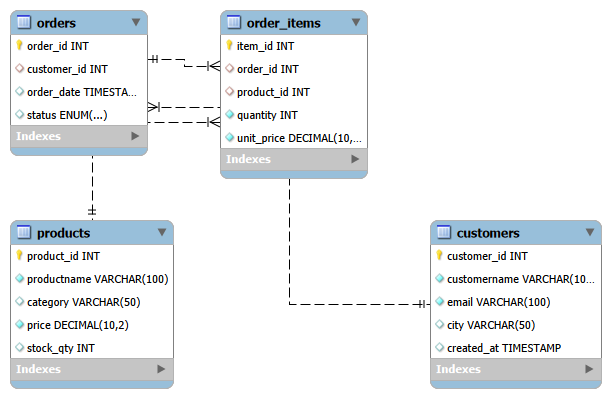

# 🛒 E-Commerce Database System — MySQL

A relational database project simulating the backend data layer of an e-commerce platform. Built using MySQL to demonstrate schema design, data relationships, and analytical querying.


## 📌 Project Overview

This project models a simple online store with customers, products, orders, and order items. It covers core database concepts including normalization, foreign key constraints, and multi-table JOIN queries.

 ### 🗂️ Database Schema

The database consists of 4 tables:

 | Table | Description |
 |---|---|
 | `customers` | Stores customer details like name, email, and city |
 | `products` | Stores product catalog with category, price, and stock |
 | `orders` | Tracks orders placed by customers with status |
 | `order_items` | Links orders to products with quantity and price |


 ### 📊 ER Diagram

 

 ### 🔍 Key Findings

 - Total revenue per customer
 - Best-selling products
 - Monthly revenue trend
 - Low stock alert
 - Average order value
 

 ### 🛠️ Tools Used
 
  MySQL Workbench


 ### 🚀 How to Run

1. Open MySQL Workbench and connect to your local server
2. Run `schema.sql` to create the database and tables
3. Run `data.sql` to populate the tables with sample data
4. Run any query from `queries.sql` to explore the data


 ### 📁 File Structure

```
ecommerce-mysql/
│  
├── schema.sql       # Database and table creation
├── data.sql         # Sample data (15 customers, 20 products, 20 orders)
├── queries.sql      # Analytical SQL queries
├── er_diagram.png   # Entity-Relationship diagram
└── README.md        # Project documentation
```
